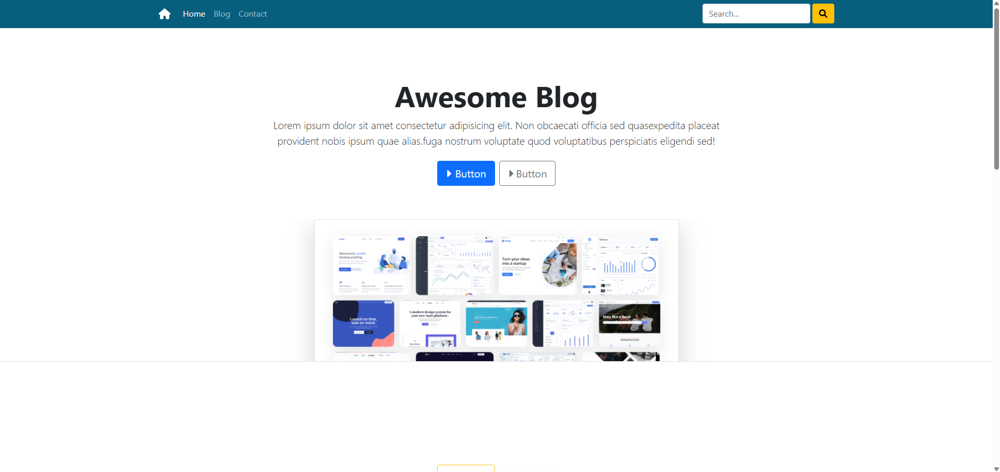

# Awesome Blog - Bootstrap Practice Project

### 🏠 Ana Sayfa


### 📝 Blog Sayfası
*Blog sayfası görüntüleri için img klasöründeki görseller kullanılmaktadır.*

### 📞 İletişim Sayfası
*İletişim formu ve harita entegrasyonu*

## 🚀 Özellikler

- **Responsive Tasarım**: Mobil, tablet ve desktop cihazlarda mükemmel görünüm
- **Modern UI/UX**: Bootstrap 5 ile temiz ve kullanıcı dostu arayüz
- **Çok Sayfalı Yapı**: Ana sayfa, blog ve iletişim sayfaları
- **Interaktif Navbar**: Mobil hamburger menü ve arama özelliği
- **Card Layout**: Blog yazıları için estetik kart tasarımları
- **Contact Form**: Kullanıcı iletişimi için form ve harita entegrasyonu
- **Font Awesome Icons**: Modern ikon kullanımı

## 📁 Proje Yapısı

```
Blog-Sample/
├── index.html          # Ana sayfa
├── blog.html           # Blog sayfası
├── contact.html        # İletişim sayfası
├── css/
│   └── style.css       # Özel CSS stilleri
├── img/
│   ├── bg.png          # Ana sayfa arka plan görseli
│   ├── 1.jpeg          # Blog görselleri
│   ├── 2.jpeg
│   ├── 3.jpeg
│   ├── 4.jpeg
│   ├── 5.jpeg
│   ├── 6.jpeg
│   └── 7.jpeg
└── README.md           # Proje dokümantasyonu
```

## 🛠️ Kullanılan Teknolojiler

- **HTML5**: Semantik markup yapısı
- **CSS3**: Özel stil tanımlamaları
- **Bootstrap 5.1.3**: Responsive framework
- **Font Awesome 6.0.0**: İkon kütüphanesi
- **Google Maps**: Harita entegrasyonu
- **JavaScript**: Bootstrap bileşenleri için

## 📱 Sayfalar

### 🏠 Ana Sayfa (index.html)
- Hero section ile çarpıcı giriş
- Blog kartları grid yapısı
- Call-to-action butonları
- Responsive navbar

### 📝 Blog Sayfası (blog.html)
- Sidebar kategori menüsü
- Blog yazıları liste görünümü
- Breadcrumb navigasyon
- Pagination özelliği

### 📞 İletişim Sayfası (contact.html)
- İletişim formu
- Google Maps entegrasyonu
- Responsive form tasarımı
- Form validasyon desteği

## 🎨 Tasarım Özellikleri

- **Renk Paleti**: Mavi tonları (#085e7d) ve sarı aksanlar
- **Typography**: Modern font hierarşisi
- **Spacing**: Tutarlı margin ve padding değerleri
- **Shadows**: Kart ve buton gölgelendirmeleri
- **Hover Effects**: İnteraktif kullanıcı deneyimi

## 🚀 Kurulum ve Çalıştırma

1. **Projeyi klonlayın:**
   ```bash
   git clone [proje-url]
   cd Blog-Sample
   ```

2. **Dosyaları açın:**
   - `index.html` dosyasını web tarayıcınızda açın
   - Alternatif olarak live server kullanın

3. **Gereksinimler:**
   - Modern web tarayıcısı (Chrome, Firefox, Safari, Edge)
   - İnternet bağlantısı (CDN kaynakları için)

## 📝 Kullanım

### Navbar Navigation
- Ana sayfa, blog ve iletişim sayfaları arasında geçiş
- Mobil menü toggle özelliği
- Arama fonksiyonu

### Blog Sistemi
- Kategori filtreleme
- Sayfalama (pagination)
- Responsive kart düzeni

### İletişim Formu
- Email, isim, telefon, konu ve mesaj alanları
- Form validasyon
- Google Maps konum gösterimi

## 🔧 Özelleştirme

### CSS Değişkenleri
```css
:root {
  --primary-color: #085e7d;
  --secondary-color: #ffc107;
  --dark-color: #212529;
}
```

### Responsive Breakpoints
- **Mobile**: < 768px
- **Tablet**: 768px - 992px
- **Desktop**: > 992px

## 📱 Responsive Özellikler

- Mobil-first yaklaşım
- Esnek grid sistemi
- Adaptive navigation
- Touch-friendly interface
- Optimized images

## 🎯 Bootstrap Bileşenleri

- **Navbar**: Responsive navigation
- **Cards**: Blog ve içerik kartları
- **Forms**: İletişim formu
- **Buttons**: Call-to-action butonları
- **Grid System**: Responsive layout
- **Utilities**: Spacing ve color utilities

## 📄 Lisans

Bu proje eğitim amaçlı geliştirilmiştir. Özgürce kullanabilirsiniz.
- [ ] Arama fonksiyonalitesi
- [ ] Kategori filtreleme
- [ ] Dark mode desteği
- [ ] Animation efektleri
- [ ] Backend entegrasyonu

## 📄 Lisans

Bu proje eğitim amaçlı geliştirilmiştir. Özgürce kullanabilirsiniz.

## 👨‍💻 Geliştirici

**Emre Yılmaz**
- 📧 Email: [email@example.com]
- 💼 LinkedIn: [linkedin.com/in/emreyilmaz]
- 🐙 GitHub: [github.com/emreyilmaz]

## 🙏 Teşekkürler

Bu proje Bootstrap framework'ü ve açık kaynak topluluğunun katkılarıyla geliştirilmiştir.

---

⭐ Bu projeyi beğendiyseniz yıldız vermeyi unutmayın!
